# Camera and Curls

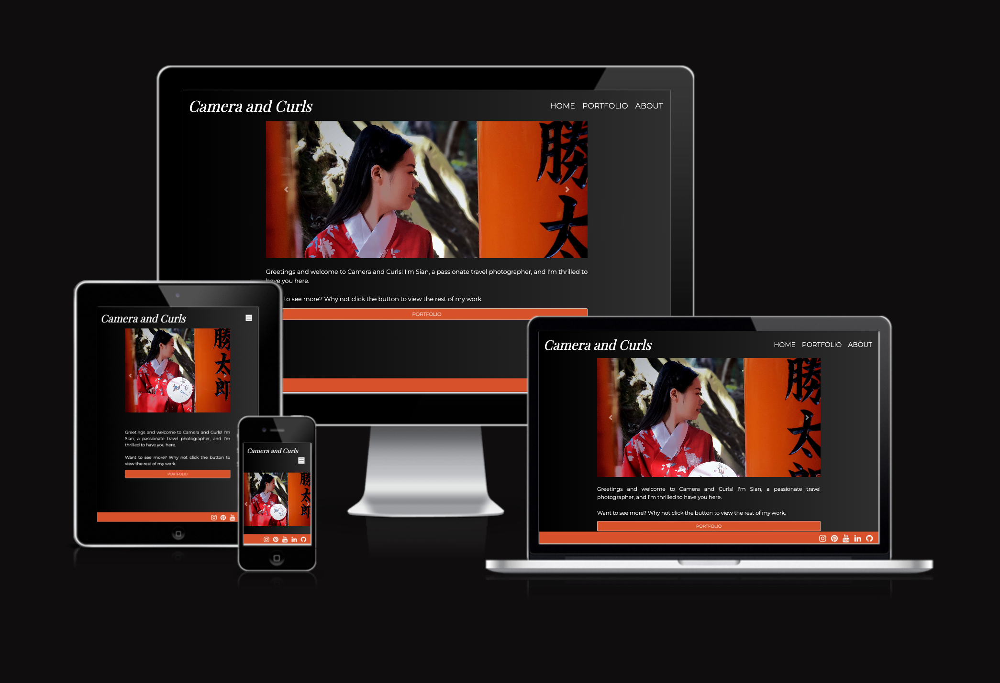

I decided to build a portfolio to showcase my photography and provide a means of contact for people that would like to collaborate. You are able to visit this [here](https://sian504.github.io/camera_and_curls/).

## Business Goals

The business goals for the portfolio are as follows:

1. Showcase Work and Build a Strong Brand Presence: The primary goal of the portfolio website is to showcase my best photography. It allows me to present my unique style and creativity while also helping to build a strong brand presence on social media.

2. Attract Potential Collaborators: A well-curated portfolio website can attract potential collaborators. Creatives looking for photographers often search for portfolios to evaluate the photographer's skills and suitability for their specific needs.

3. Show Progress and Growth: The portfolio website will act as a timeline of my progress and growth over time. It allows viewers to see how my style has evolved, building a narrative around my artistic journey.

## First Time User Stories

- As a first time user, I want to see a visually appealing portfolio, so I can quickly understand the photographer's style.
- As a first time user, I want to navigate a clear and intuitive portfolio, so I can easily explore different sections, such as the photographer's different categories of work and their contact page.
- As a first time user, I want to view high-quality images in a responsive image gallery, so I can enjoy the photographer's work on any device without sacrificing image quality.

## Returning User Stories

- As a returning user, I want to see new additions to the photographer's portfolio, so I can stay updated with their latest work and creative projects.
- As a returning user, I want to access the photographer's social media links, so I can follow their updates on different platforms and share their work with my network.
- As a returning user, I want to access the photographer's contact page so I can give feedback and ask about a potential collaboration.

---

## UX

I designed the portfolio using the core principles of UX. I used this framework to think about my target users and what features would be present on the website.

## Strategy

Camera and Curls is aimed at the following users:

- Art Enthusiasts: People who appreciate fine art photography and may be interested in purchasing prints or supporting your artistic endeavors.
- Potential Collaborators: Other artists, photographers, or creative professionals who may be interested in collaborating on joint projects or exhibitions.
- Fans and Followers: Individuals who are interested in your work, follow you on social media, and regularly engage with your photography content.
- Students and Aspiring Photographers: Individuals interested in learning more about photography techniques, styles, and artistic vision.

These users would be looking for the following:

- Responsive Design: The website should be fully responsive, adapting to different screen sizes and devices, including desktops, laptops, tablets, and smartphones.
- Intuitive Navigation: A user-friendly navigation menu and clear layout help users find what they're looking for easily. A logical hierarchy and straightforward navigation enhance the overall browsing experience.
- Contact Form: Users should easily find contact information or a contact form to inquire about collaborations or other inquiries.
- Image Gallery and Slideshow: A visually appealing image gallery or slideshow feature allows users to view photographs in an engaging and immersive manner.

I wanted to keep the portfolio simple and sleek as well as intuitive. I wanted the photographs presented in the best possible way so that the user was able to understand my photographic style right away.

## Scope

To achieve the business goals and user requirements, I will be including the following features:

- Header and menu that allows users to navigate through all pages of the portfolio
- A visually appealing slideshow of some selected images
- Portfolio page arranged in chronological order
- Contact page for potential collaborators and fan enquiries
- Links to social media pages

## Structure

The website will consist of 3 pages:

1. Home page
2. Portfolio page
3. Contact form for users who would like to request to work together on a creative project

These pages will be contained in a navigation bar that will appear at the top of each page so that the user is able to navigate easily through all sections of the site. The order of the navigation bar appears in order of priority Home > Portfolio > Contact. I believe this is a natural progression for the user and a layout that will allow them to enjoy the photos best.

The homepage will consist of a visually appealing slideshow of some of my photos along with a short About Me section so that they are able to find out some information about the photographer. All text blocks will be minimal to not distract the user from the images. The portfolio section will allow the user to delve deeper into different categories of photos that I have taken. These will be arranged by the countries they were taken in, in chronological order, so that they are able to see the progression in my ability and style. The contact form will consist of a hero image of a selected photo with a form that allows users to leave their contact details and leave feedback or request to be contacted about a potential collaboration.

## Skeleton

I have linked the wireframes for each device below: 

- [Desktop](assets/wireframes/desktop-view.pdf)
- [Tablet](assets/wireframes/tablet-view.pdf)
- [Mobile](assets/wireframes/mobile-view.pdf)

Since creating the wireframes I made a few changes to the layout of the website. I removed the image of me from the homepage as I feel that this was taking too much real estate on the page and detracting from the image slideshow. Instead I moved this to the new About page that was previously called Contact. I did not make this a hero image as previously planned as the photo would have appeared stretched on the page.

I also changed the small about section on the home page to underneath the slideshow to stay consistent on all devices. 

I decided to rename the Contact page to About so that users could find out some more about the photographer and added the contact form at the end to satisfy the user goals. 

## Surface

The website will be presented with a black background throughout with the exception of the contact page, which will feature a hero image of a selected photo in the background with a contact form layered over the top of it. The reason for the black background choice is to ensure that the photos will visually stand out. The nav bar will be a contrasting color with an image of me in the top left corner of the screen. The text will be white to contrast the dark color of the background to allow users to read the about me section clearly.

I will be using Playfair Display for the headings and Montserrat for the body. By using this font pairing, my portfolio website will have a cohesive and polished appearance, while still allowing the images to take center stage.

---

## Features 

The website was designed mobile-first as it is likely that users will be viewing this on their phone. There are 3 pages that are displayed in the order Homepage > Portfolio > About. The colour theme is black, white and red throughout. All headings have been given the font Playfair Display and the body text is using Montserrat. The colour scheme and font have been used throughout for consistency. 

### Menu 

### Desktop view

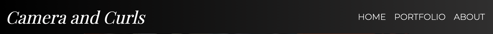

### Small screen view

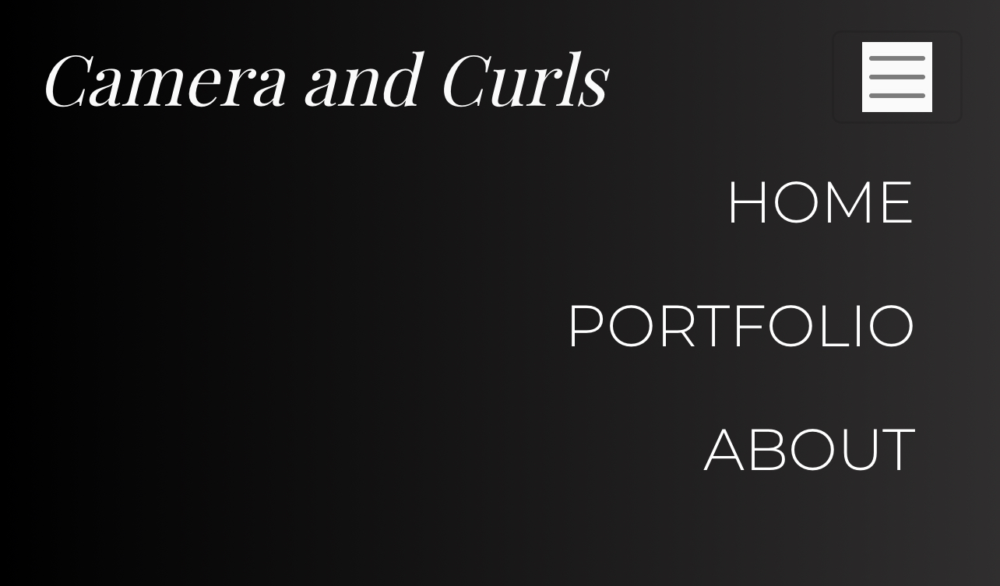

The navbar and menu items are positioned in the top right of the screen. It consists of 3 links on the desktop view for each available page and has been condensed into a hamburger menu for tablet and mobile. I chose this menu for the smaller screens as the text for the menu items was showing as quite small and could have been an issue for users when trying to navigate. 

This satisfies the user story: As a first time user, I want to navigate a clear and intuitive portfolio, so I can easily explore different sections, such as the photographer's different categories of work and their contact page.

### Image slideshow

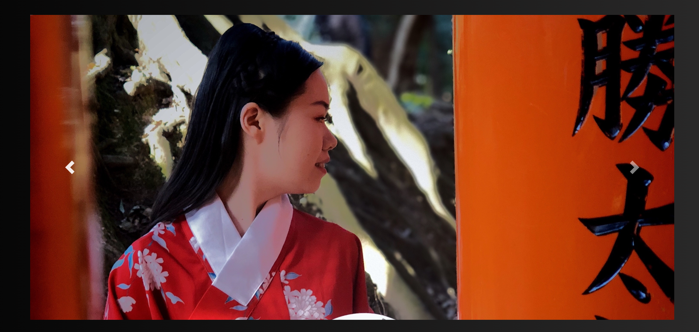

The slideshow takes up most of the real estate on the homepage on all devices. It carousels 4 visually striking images that are designed to entice the user to click on the portfolio call to action button to take a look at the rest of the collection. The slideshow does automatically display each image and there are 'next and previous' buttons should the user want to find the image they want to look at.  

This satisfies the user story: As a first time user, I want to see a visually appealing portfolio, so I can quickly understand the photographer's style.

### Portfolio 

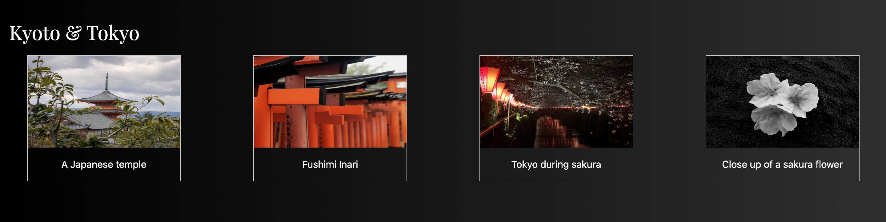

The portfolio page is laid out by country and displays a H2 heading stating the name of the country and 4 thumbnail images with a description of each underneath. The user is able to click these thumbnails to see a larger size of the photo if they want to. This slideshow is responsive and is laid out slightly different on the mobile and tablet to ensure that the user can still look at the photos without having to enlarge them if they want. 

This also satisfies the user story: As a first time user, I want to see a visually appealing portfolio, so I can quickly understand the photographer's style and also: As a first time user, I want to view high-quality images in a responsive image gallery, so I can enjoy the photographer's work on any device without sacrificing image quality.

### About/ Contact page 

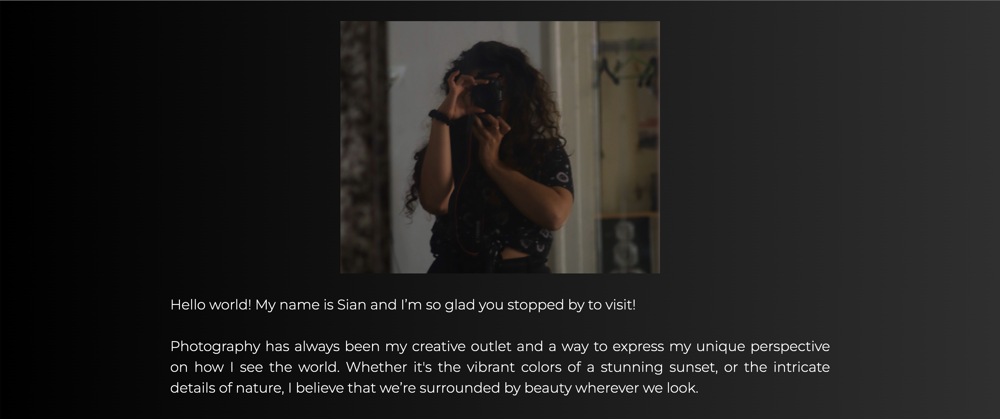

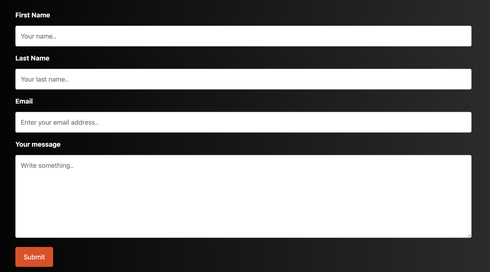

The About page contains an image of me and gives the user a little insight into my route into photography and how I got into taking photos. This text introduces the contact form which consists of 3 text inputs and an email input. The name and email address are required to submit the form so that I am able to respond to them. I styled this to match the overall feel of the website. 

This satisfies the user story: As a returning user, I want to access the photographer's contact page so I can give feedback and ask about a potential collaboration.

### Social links 

In the footer, I have added 5 Font Awesome icons linking users to Instagram, Pinterest, YouTube, LinkedIn and GitHub if they wish to view more photos or learn more about me.

This satisfies the user story: As a returning user, I want to access the photographer's social media links, so I can follow their updates on different platforms and share their work with my network.

---

## What I used

To create this project I used the following:

- HTML - The coding language used to create the structure of the website.
- CSS  -The coding language used to style the site throughout.
- Javascript - This was taken from Bootstrap and assisted with the responsive navbar.
- Google Fonts - Fonts for both the headers and the body text were taken from here. The fonts I used were Playfair and      Montserrat.
- Font Awesome - Used for the social media icons in the footer.
- Chrome Developer Tools - Used to test responsiveness across the site.
- GitHub - Used as a storage space for my pushed code.
- Git - Used for version control to make commits and push to GitHub.
- CodeAnywhere - The cloud development environment I used to build the site.
- Balsamiq - Used to create the wireframes.
- W3C Markup Validation Service - Used to validate all HTML written for the site.
- W3C CSS Validation Service - Validated all CSS code written for the site.
- [AmIResponsive](https://ui.dev/amiresponsive) - Used to create the responsive image you see at the top of the README file.

---

## Testing

### HTML and CSS Validation 

I validated my code at the end of the build which I would not recommend doing as it may result in having to unravel a lot of code to fix any errors. Checking at incremental stages of the build will be my preferred method of validating code in future projects. In this case I was fortunate and was only required to change minimal lines of code in both HTML and CSS. 

I used W3C Markup Validation Service to validate my HTML and W3C CSS Validation Service to validate my CSS. 

The errors found in each were as follows: 

#### index.html

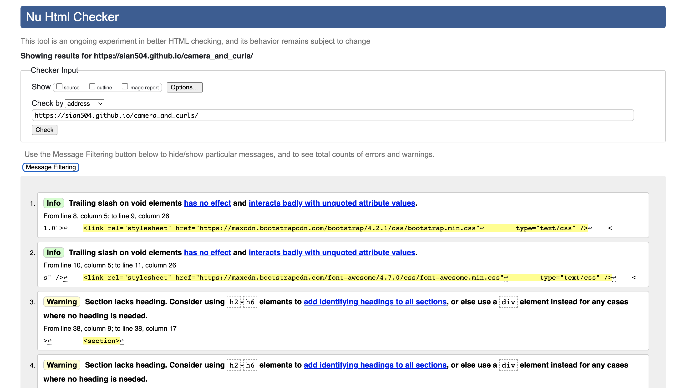

These were fixed by removing the slashes from the Bootstrap and Font Awesome and removing the section tags from the image slideshow and the small about me text on the homepage. These were both returning this warning because there was no appropriate heading to introduce the section. I didn't believe either of these features required a heading introducing them and so chose to remove the section tags. 

#### portfolio.html 

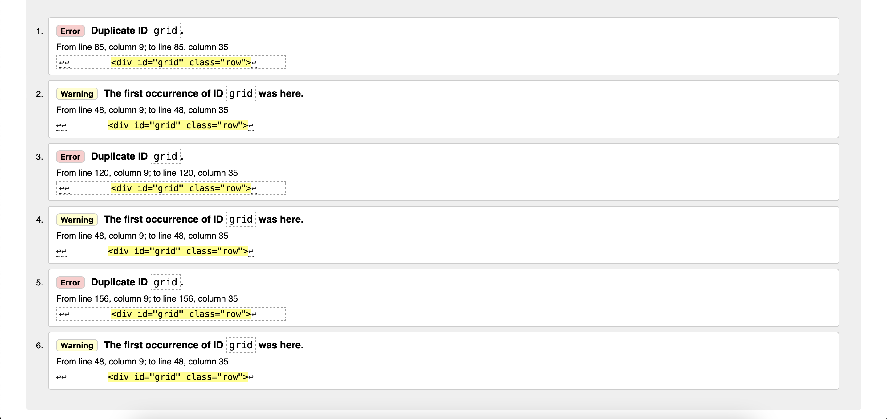

I originally applied an ID of grid to each div on the portfolio page as I believed I would need an ID attribute to centre each image. I replaced the ID with a class and the positioning stayed the same which resolved the error/ warning. 

#### about.html

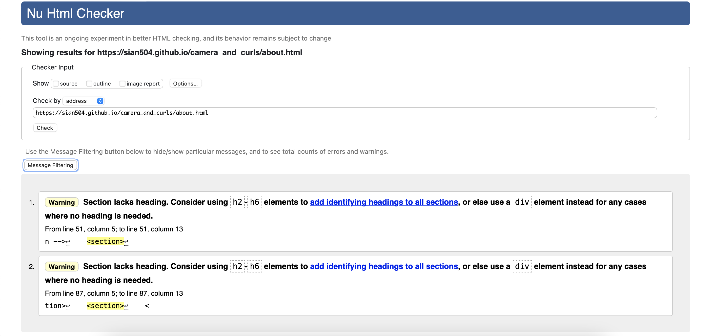

This error occurred because I originally did not give the About me section on the About page or the contact form a heading. I decided that it would be beneficial to include these headings marking each section so it would give a clear indication on what the user could find on this page at a clance. 

Both the submitted.html and 404.html files validated on the first try. 

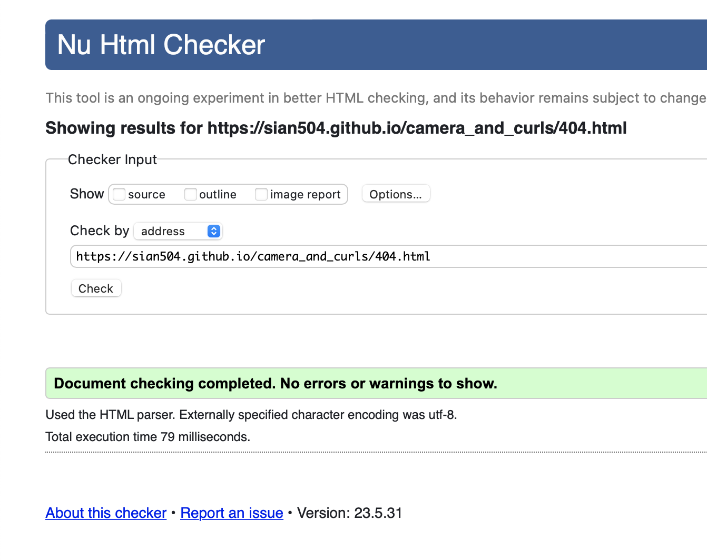

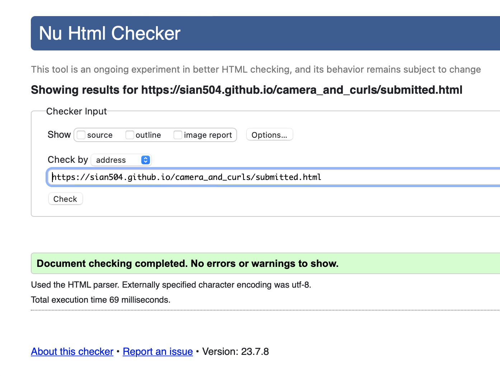

#### style.css

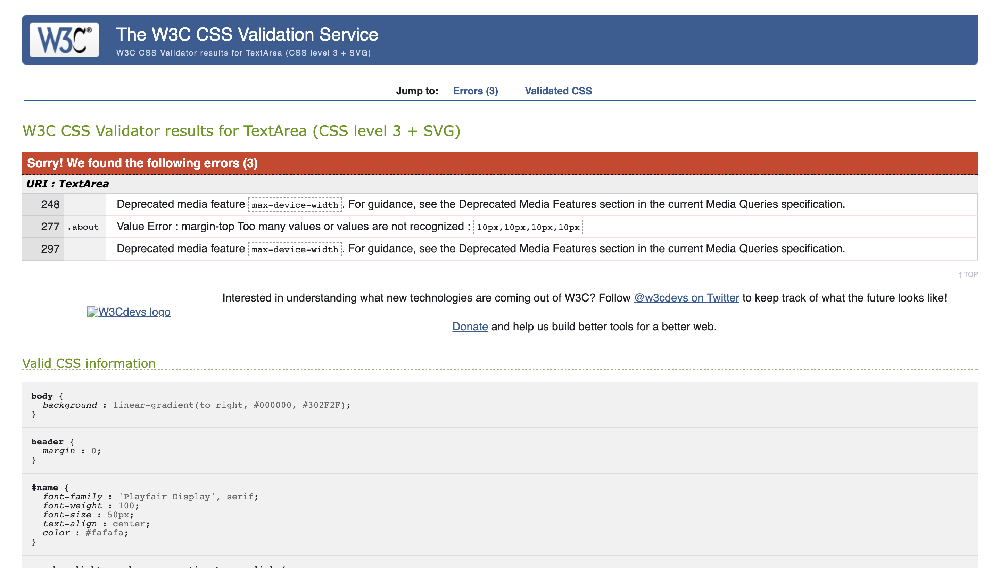

The errors were resolved by replacing 'max-width-device' in the media queries to max-width. This was a deprecated feature that I had included when I was researching media queries on the blog post: [Media Queries Demystified: CSS Min-Width and Max-Width](https://www.emailonacid.com/blog/article/email-development/emailology_media_queries_demystified_min-width_and_max-width/).

The margin error issue was resolved by removing three of the four values from the margin-top of the about class. 
 
### Lighthouse 

Lighthouse is a feature of Chrome developer tools that performs an audit of any URL that it's given and returns an overall score based on website's performance. When I audited the site it returned this: 

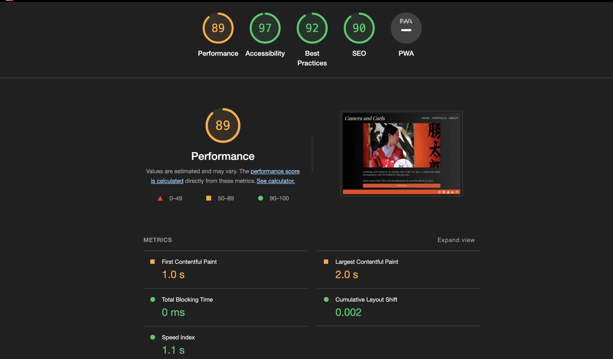

Considering that I was so close to the project deadline and that this was so close to a 'good' score, I decided that I would prioritise the documentation write up over improving this. To improve the Lighthouse score I would have reduced the size of the images on the homepage slideshow by applying srcset. This would have decreased the time it takes for the slideshow to load. This is important in terms of performance as I believe the image slideshow would be the first contentful paint of the site and having this load quicker would contribute to a better user experience. 

### Further Testing

In addition to the validation and Lighthouse, I used Chrome developer tools and the browser preview to test the efficacy of the CSS styling. 

I also sent the site across to a lot of friends and family for them to view on a variety of devices and browsers to ensure responsiveness. 

### Known Bugs and Improvements

An unresolved issue present on the site is the gap between the right side of the site and the end of the browser window which is visible on all screensizes. You are able to see what I mean in the below screenshot: 

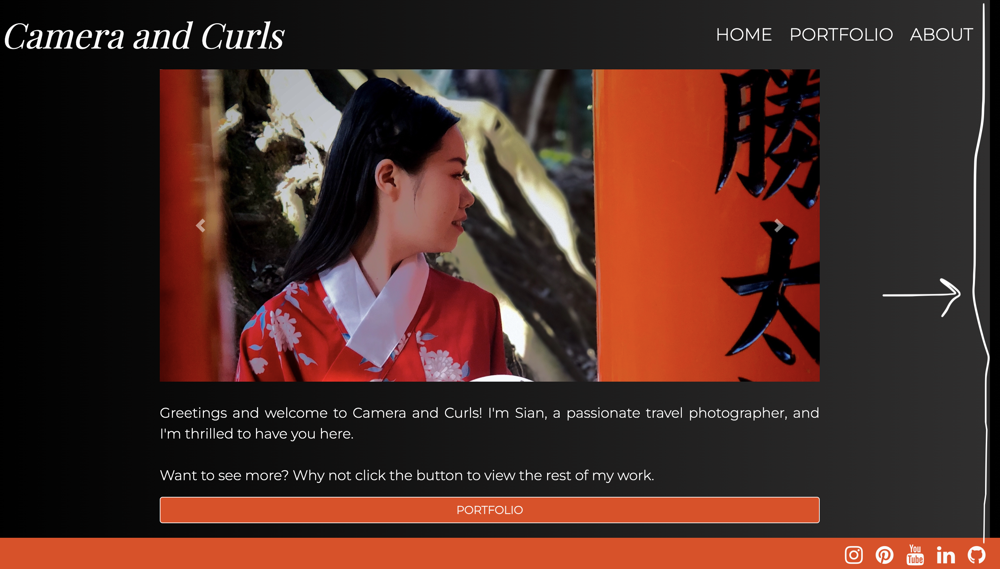

I believe this may be caused by my use of the Bootstrap grid to force my divs to centre on the page. I will illustrate my point using the code in my index.html page. 

When I first added the slideshow onto the homepage, I had an issue with getting it to centre on the page. To resolve this I including col-md-2 on either side of the slideshow as indicated in the above photo. The empty divs forced the slideshow to centre without having to apply any additional CSS. I did this on a lot of my HTML pages to force the desired positioning which is why I believe this issue is present on other pages too.

Whilst I was successful in forcing the positioning, I have a suspicion that the columns are causing this gap. If I were to have more time, I would have done further research into applying effective styling that would have centered the slideshow without having to use the Bootstrap grid in this way. 

Another feature I decided to de-prioritise was to add a 'new additions' section of the portfolio which would have satisfied the following user story: As a returning user, I want to see new additions to the photographer's portfolio, so I can stay updated with their latest work and creative projects

I would have liked to have used Javascript to create a moving border to indicate this section so it would stand out to returning users when they navigated to the portfolio page. I would have liked this to look similar to what is shown in the article [CSS border animations](https://web.dev/css-border-animations/).

## Deployment

The project is deployed using GitHub pages. This was achieved by completing the following steps: 

1. Navigate to the "Settings" tab in the GitHub repository.
2. Select "Pages" from the menu on the left.
3. Under the "Source" section, select "Deploy from a branch" and "Branch: main." Click on "Save."
4. GitHub takes a short while to publish the website. Refresh the page, if not done automatically, and once the website is deployed, the URL will be displayed.

### Forking the Github Repository

If you want to make changes to your repository without affecting it, you can make a copy of it by 'Forking' it. This ensures your original repository remains unchanged.

You can fork a GitHub Repository by completing the following steps: 

1. Find the GitHub repository.
2. At the top of the page to the right, under your account, click the Fork button.
3. You will now have a copy of the repository in your GitHub account.

### Cloning the GitHub Repository

Cloning your repository will allow you to download a local version of the repository. Cloning can also be a great way to backup your work. 

You can clone your repository by completing the following steps: 

1. Find the relevant GitHub repository
2. Press the arrow on the Code button
3. Copy the link that is shown in the drop-down
4. Now open Gitpod & select the directory location where you would like the clone created
5. In the terminal type 'git clone' & then paste the link you copied in GitHub
6. Press enter and your local clone will be created.
   
---

## Credits 

I have used a number of resources to produce this website, where code has been used found from another source this is credited as a comment within the HTML and CSS files.

I was assisted by various articles involving: 

[Background colour design](https://www.youtube.com/watch?v=K3NNBnSA3C4) This website helped me in particular with the linear gradient of the background colour. I felt this added more style to the website over the original black background. 

[Contact form](https://www.w3schools.com/howto/howto_css_contact_form.asp) This was used as a general template but adapted the html to suit the needs of the site. I also applied additional styling to maintain the overall look of the site.

[Media Queries](https://www.emailonacid.com/blog/article/email-development/emailology_media_queries_demystified_min-width_and_max-width/) - This was used in particular to ascertain the correct pixel sizes to put into the media query to target the correct device.

[Image Gallery](https://www.w3schools.com/css/css_image_gallery.asp) - This site provided the code to build the image gallery on the portfolio page. This was adapted to fit into the Bootsrap grid and styled by further CSS to be in keeping with the site's aesthetic. [Stack Overflow](https://www.w3schools.com/css/css_image_gallery.asp) were also instrumental in helping me to achieve centering the gallery. 

---

## Acknowledgements 

I would like to thank my mentor, Harry Dhillon for all of his support and guidance through the creation of this project. 